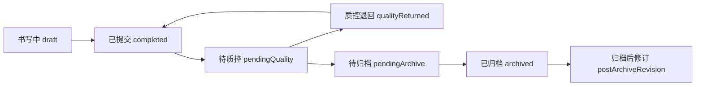

# 病历质控与归档运营闭环说明

本文档描述平台层 `src/platform/emr-workbench/` 当前已落地的病历质控、归档状态流、缺陷模型和模板反哺链路，便于产品、测试和研发对齐。

## 1. 模块职责总览

- 病历质控中心：`medical-record-quality-center`
  - 汇总病历问题，输出阻断项、警告项、风险等级和筛选维度。
  - 支持规则包匹配、规则命中统计和规则变更影响评估。
- 病历运营闭环工作台：`medical-record-operations-center`
  - 在一个工作台集中展示待质控、退回整改、待归档和归档阻断病历。
  - 联动缺陷整改中心和归档质检中心，减少跨弹层切换。
- 归档质检中心：`archive-center`
  - 基于质控结果构建归档检查清单，判断是否可归档。
  - 维护“书写中 -> 已提交 -> 待质控 -> 质控退回 -> 待归档 -> 已归档 -> 归档后修订”运营视图。
- 缺陷整改中心：`defect-center`
  - 将质控 issue 固化为缺陷单，支持退回、整改、复核关闭。
  - 支持高频缺陷转模板问题单。

## 2. 领域服务边界

- `MedicalRecordDomainService`
  - 负责病历实例生命周期、归档冻结、归档后修订申请/审批与时间线。
- `MedicalRecordDefectDomainService`
  - 负责缺陷模型、状态流转和缺陷留痕。
- `TemplateDomainService`
  - 负责模板问题反馈记录、修订草稿、试运行验证与发布记录。

边界原则：病历事实留在病历域，缺陷留在缺陷域，模板修复动作留在模板域；模块层只做编排与视图组装。

## 3. 归档状态流



状态判定关键点：

- 只要存在阻断项，归档中心将病历视为 `qualityReturned`。
- `signed + review + blocker=0` 才能进入可归档态。
- 归档前除质控阻断项外，还会校验未关闭缺陷数量，未关闭缺陷会阻断归档。
- 归档后修订不会覆盖归档快照，只追加修订记录和审批轨迹。

## 4. 缺陷模型与闭环动作

缺陷核心字段：

- 病历实例：`documentId`
- 模板定位：`templateId`、`templateVersion`
- 问题定位：`fieldId`、`fieldLabel`、`category`
- 责任与状态：`owner`、`status`

缺陷状态流：

```text
open -> returned -> rectified -> closed
open/returned/rectified -> templateIssue
```

每次流转都会写入病历 trace，形成“退回原因 -> 整改说明 -> 复核意见”的追责链路。

## 5. 模板反哺链路

来自病历端的高频问题可进入模板侧闭环：

1. 缺陷转模板问题单。
2. 生成修订草稿。
3. 试运行验证。
4. 发布上线。
5. 影响范围复核（已归档病历范围、风险文书类型）。

平台层以版本中心作为统一展示入口，避免把病历运营细节回灌到编辑器内核。

## 6. 测试覆盖建议

当前建议重点关注以下三类测试：

- 视图模型测试：验证质控、归档、缺陷中心的汇总和筛选正确性。
- 领域流转测试：验证缺陷、归档后修订、模板反馈状态机。
- 集成流程测试：覆盖“病历提交 -> 质控退回 -> 医生整改 -> 复核通过 -> 归档冻结”的关键链路。

参考：

- `tests/platform/medicalRecordQualityCenter.test.ts`
- `tests/platform/medicalRecordArchiveCenter.test.ts`
- `tests/platform/medicalRecordDefectCenter.test.ts`
- `tests/platform/medicalRecordWorkflowIntegration.test.ts`