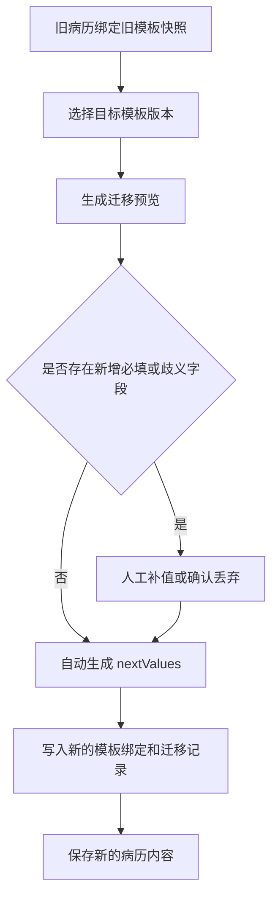

# 病历存储与迁移落地方案

本文档是 [模板与病历数据存储方案](./template-storage.md) 的落地补充，目标不是重复原则，而是给出一套可以直接进入产品评审、架构评审和后端接口评审的推荐方案。

适用范围：

- 面向医院病历、护理记录、检验报告、知情同意、会诊记录等文书实例存储。
- 面向模板持续迭代、历史病历长期可回显、低成本上线和可控迁移。

## 一、推荐结论

推荐采用下面这条主线：

1. 模板中心保存模板主档和版本快照。
2. 新建病历绑定一个明确模板版本。
3. 病历实例同时保存模板快照、字段值和可选编辑态。
4. 历史病历默认冻结，不自动跟随模板变化。
5. 模板升级仅允许通过“显式迁移”完成，不允许隐式漂移。

一句话概括：

> 运行时以病历快照为准，设计时以模板版本为准，升级时以迁移计划为准。

这是当前“效率、成本、稳定性”三者之间最均衡的方案。

## 二、为什么这是最适合病历场景的方案

常见几种做法对比如下：

| 方案 | 优点 | 问题 |
| --- | --- | --- |
| 只存 `templateId` + 字段值 | 实现简单 | 模板一改，历史病历可能错位或打不开 |
| 只存 HTML / PDF | 归档简单 | 不利于结构化查询、迁移和重新编辑 |
| 只存 editorState | 回显完整 | 后端查询、报表、质控都不友好 |
| 模板版本 + 快照 + 字段值 + 结构化值 | 可回显、可迁移、可审计 | 比纯 KV 多一点存储成本，但收益最高 |

病历系统和普通表单系统最大的不同是：

1. 历史留痕比“总是用最新模板”更重要。
2. 结构化出参与质控统计是真实需求。
3. 审签、归档、追责要求当时看到的文书结构可重放。

因此推荐方案必须优先满足：

1. 历史病历不被新模板带坏。
2. 新模板可以持续发布。
3. 旧病历升级时有预览、有差异、有审计。

## 三、产品规则

### 1. 新建病历

规则：

1. 默认绑定模板最新发布版本。
2. 创建成功后即写入模板绑定信息。
3. 自动暂存只更新病历内容，不改变模板绑定。

产品提示建议：

- 新建病历时可见“当前模板版本：v1.2.0”。
- 若模板处于灰度或科室限定状态，应在创建前拦截。

### 2. 编辑中的病历

规则：

1. 默认持续使用创建时绑定的模板快照。
2. 模板中心发布新版本后，不自动刷新当前病历。
3. 允许用户主动查看“有新模板可升级”。

产品价值：

- 避免医生填写中途字段布局变化。
- 避免必填项规则突然变化导致保存失败。

### 3. 已签名 / 已归档病历

规则：

1. 默认禁止模板迁移。
2. 如业务必须升级，只允许“复制为新病历版本”后迁移。
3. 原病历保留原模板绑定和原快照，不覆盖。

### 4. 模板升级

规则：

1. 模板发布只影响新建病历。
2. 旧病历默认冻结。
3. 需要升级时，先做迁移预览，再做迁移确认。
4. 迁移前必须展示新增必填字段、无法映射字段和被丢弃字段。

## 四、数据模型建议

### 1. 模板定义层

建议至少拆两张表：

```ts
interface EmrTemplateDefinition {
  templateId: string
  code: string
  name: string
  category: string
  ownerDept?: string
  status: 'draft' | 'review' | 'published' | 'archived'
  currentPublishedVersion?: string
  createdAt: number
  updatedAt: number
}

interface EmrTemplateVersion {
  templateId: string
  version: string
  schema: ITemplateSchema
  status: 'draft' | 'review' | 'published' | 'archived'
  note?: string
  createdAt: number
  publishedAt?: number
}
```

设计原则：

1. 已发布版本不覆盖，只新增版本。
2. 模板主档只维护当前状态，不维护病历实例数据。
3. schema 按完整 JSON 保存，避免过早拆表。

### 2. 病历实例层

病历实例建议最少保存下面这些字段：

```ts
interface EmrRecordDocument {
  documentId: string
  patientId: string
  encounterId: string
  title: string
  status: 'draft' | 'completed' | 'signed' | 'archived'
  templateId: string
  templateVersion: string
  templateSnapshot: ITemplateSchema
  flatValues: Record<string, string | null>
  structuredValues?: Record<string, unknown>
  editorState?: unknown
  createdAt: number
  updatedAt: number
}
```

其中：

1. `templateId + templateVersion` 用于追踪来源。
2. `templateSnapshot` 用于长期回放和审计。
3. `flatValues` 用于轻量暂存、回填和检索。
4. `structuredValues` 用于结构化提交、统计和集成接口。
5. `editorState` 只服务高保真编辑态恢复。

### 3. 迁移记录层

推荐单独记录迁移轨迹：

```ts
interface EmrDocumentMigrationRecord {
  migrationId: string
  documentId: string
  fromTemplateVersion: string
  toTemplateVersion: string
  migratedAt: number
  operatorId: string
  note?: string
  mappings: Array<{
    fromFieldId: string
    toFieldId: string
    matchBy: 'fieldId' | 'businessCode' | 'exportPath'
  }>
  unresolvedFieldIds: string[]
  droppedFieldIds: string[]
}
```

这部分可以先冗余在病历记录里，后续再拆迁移表。

## 五、存储策略建议

### 1. 自动暂存

推荐保存：

1. `flatValues`
2. `editorState`
3. `updatedAt`

特点：

- 写入频率高。
- 不必每次都做完整结构化提取。
- 重点是恢复编辑现场。

### 2. 正式保存

推荐保存：

1. `templateId`
2. `templateVersion`
3. `templateSnapshot`
4. `flatValues`
5. `structuredValues`
6. `editorState`（可选）

结构化值建议直接复用运行时抽取结果，见 [src/editor/template/TemplateRuntime.ts](../../src/editor/template/TemplateRuntime.ts)。

### 3. 归档副本

归档阶段建议额外生成：

1. PDF 副本
2. 打印版 HTML 或渲染快照

但注意：

- PDF 只用于归档和法务留存。
- 真实业务主数据仍以病历实例记录为准。

## 六、性能与成本控制

### 1. 先 JSON，后拆分

初期推荐：

1. 模板 schema 存 JSON。
2. templateSnapshot 存 JSON。
3. structuredValues 存 JSON。
4. editorState 存 JSON。

原因：

1. 研发成本最低。
2. 结构演进最灵活。
3. 足以支撑中早期业务验证。

### 2. 用冗余索引换查询效率

病历主表上建议单独建立索引字段：

1. `patientId`
2. `encounterId`
3. `templateId`
4. `templateVersion`
5. `status`
6. `updatedAt`
7. `deptId` / `ownerDept`（如有）

这样多数列表查询无需扫描 JSON。

### 3. 冷热分层

低成本策略建议：

1. 最近 6-12 个月病历保留完整在线数据。
2. 历史病历把 `editorState` 和大快照迁移到对象存储。
3. 在线库保留病历主索引、模板绑定和必要结构化值。

适用条件：

- 历史病历访问频率低。
- 更关注成本而不是秒级编辑恢复。

### 4. 不要过早做字段拆表

除非已经出现：

1. 超大规模结构化检索。
2. 跨模板统一字段统计。
3. 大量 BI / 质控模型依赖。

否则不建议一开始把每个字段拆成 EAV 表，因为这会显著增加研发和维护成本。

## 七、迁移机制建议

### 1. 默认策略

默认只允许：

1. 新病历使用新模板。
2. 旧病历保持原模板快照。
3. 手动触发迁移预览。

### 2. 匹配优先级

推荐保持当前实现：

1. `fieldId`
2. `metadata.businessCode`
3. `metadata.exportPath`

这与当前实现一致，见 [src/editor/template/TemplateDocumentStore.ts](../../src/editor/template/TemplateDocumentStore.ts)。

### 3. 迁移流程



### 4. 风险分级

低风险变更：

1. 标题修改。
2. 排版调整。
3. 新增非必填字段。

建议：允许跳过迁移。

中风险变更：

1. 字段 ID 重命名。
2. 字段移动分组。
3. 语义不变但结构调整。

建议：允许自动迁移，但必须预览。

高风险变更：

1. 删除字段。
2. 修改字段类型。
3. 新增必填字段。
4. 一个字段拆多个字段。

建议：默认阻断自动迁移，必须人工处理。

## 八、接口设计草案

### 1. 模板中心

```http
POST /api/emr/templates
POST /api/emr/templates/:templateId/versions
POST /api/emr/templates/:templateId/publish
GET  /api/emr/templates/:templateId/versions
GET  /api/emr/templates/:templateId/versions/:version
```

职责：

1. 维护模板主档。
2. 维护版本快照。
3. 维护发布状态。

### 2. 病历中心

```http
POST /api/emr/documents
GET  /api/emr/documents/:documentId
PUT  /api/emr/documents/:documentId
POST /api/emr/documents/:documentId/autosave
POST /api/emr/documents/:documentId/sign
POST /api/emr/documents/:documentId/archive
```

职责：

1. 管理病历实例。
2. 管理签名和归档状态。
3. 管理模板绑定，不负责模板发布。

### 3. 迁移中心

```http
POST /api/emr/documents/:documentId/migration-preview
POST /api/emr/documents/:documentId/migrate
GET  /api/emr/documents/:documentId/migration-history
```

职责：

1. 输出迁移计划。
2. 校验新增必填和歧义字段。
3. 落库迁移记录。

### 4. 典型返回结构

迁移预览接口建议返回：

```ts
interface MigrationPreviewResponse {
  fromTemplateId: string
  fromTemplateVersion: string
  toTemplateId: string
  toTemplateVersion: string
  mappings: Array<{
    fromFieldId: string
    toFieldId: string
    matchBy: 'fieldId' | 'businessCode' | 'exportPath'
  }>
  unresolvedFields: Array<{
    fieldId: string
    label?: string
    reason: 'required' | 'ambiguous'
    candidateFieldIds?: string[]
  }>
  droppedFields: Array<{
    fieldId: string
    label?: string
    value: string | null
  }>
  emptyFields: Array<{
    fieldId: string
    label?: string
    required: boolean
  }>
  nextValues: Record<string, string | null>
  canAutoApply: boolean
}
```

## 九、和当前仓库能力的对应关系

当前仓库已经有几块基础设施可以直接复用：

1. 模板主档与版本抽象： [src/editor/template/TemplateRegistry.ts](../../src/editor/template/TemplateRegistry.ts)
2. 病历实例与迁移分析： [src/editor/template/TemplateDocumentStore.ts](../../src/editor/template/TemplateDocumentStore.ts)
3. 结构化提取： [src/editor/template/TemplateRuntime.ts](../../src/editor/template/TemplateRuntime.ts)
4. 迁移回归测试： [tests/template/documentStore.test.ts](../../tests/template/documentStore.test.ts)

这意味着：

1. 方案方向已经对，不需要推倒重来。
2. 下一步重点是把“前端内存/本地存储抽象”映射到后端持久化模型。
3. 产品上补齐“迁移预览、迁移确认、签名后禁止迁移”即可形成完整闭环。

## 十、推荐实施顺序

### 阶段 1：先把病历保存闭环跑通

交付目标：

1. 模板发布版本可被新病历绑定。
2. 病历保存带上 templateSnapshot。
3. 自动暂存和正式保存分开。

### 阶段 2：补迁移预览

交付目标：

1. 病历能看到“有新模板版本”。
2. 迁移预览能输出保留、丢失、必填缺失字段。
3. 允许人工确认后迁移。

### 阶段 3：补签名与归档规则

交付目标：

1. 已签名病历禁止直接迁移。
2. 已归档病历支持复制新版本再迁移。
3. 迁移记录可审计。

实现边界建议：

1. 编辑器内核只提供通用的文档状态流转与迁移入口。
2. 具体业务规则不要硬编码在模板引擎里，而是通过可注入的 workflow policy 承接。
3. 例如“已签名禁止迁移”“草稿不能直接归档”这类规则，应由 HIS / EMR 业务层按医院制度注入，而不是写死为某一种文书规则。
4. 这样模板维护能力仍保持通用，业务系统只负责补充约束、审签、权限和时效规则。
5. 如业务要求“已归档文书只能复制新版本后再迁移”，可复用通用 `fork()` 能力生成新文档，再对新文档执行迁移，而不是在编辑器内核里写死归档文书逻辑。

### 阶段 4：做低成本优化

交付目标：

1. 冷热分层。
2. 大字段归档。
3. 结构化查询索引优化。

## 十一、最终建议

如果只能选一条主策略，推荐坚定采用：

1. 模板版本化。
2. 病历快照化。
3. 迁移显式化。
4. 存储分层化。

这样可以在不显著增加研发复杂度的前提下，同时满足：

1. 新模板快速上线。
2. 历史病历稳定可回显。
3. 对模板调整足够友好。
4. 对后续统计、质控、审计有扩展空间。