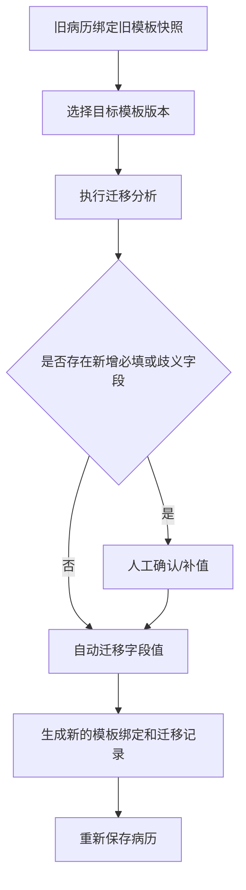

# 模板与病历数据存储方案

本文档用于约束模板平台在“模板定义”和“病历实例”两个层面的持久化策略，目标是同时解决以下问题：

1. 模板如何版本化存储。
2. 病历数据保存时到底依赖模板 ID、模板版本，还是模板快照。
3. 模板调整后，已经保存的病历是否会受影响，以及如何迁移。

## 一、分层存储原则

### 1. 模板定义层

模板属于“设计时资产”，核心特征是：

- 有版本。
- 有发布状态。
- 同一个模板会持续迭代。

当前前端对应抽象：

- [src/editor/template/TemplateRegistry.ts](src/editor/template/TemplateRegistry.ts)
- `ITemplateRegistryEntry`
- `ITemplateVersionRecord`

建议后端拆成两层：

1. `emr_template_definition`
2. `emr_template_version`

建议字段如下：

```ts
interface EmrTemplateDefinition {
  templateId: string
  code: string
  name: string
  category: string
  ownerDept?: string
  currentPublishedVersion?: string
  status: 'draft' | 'review' | 'published' | 'archived'
  createdAt: number
  updatedAt: number
}

interface EmrTemplateVersion {
  templateId: string
  version: string
  schema: ITemplateSchema
  status: 'draft' | 'review' | 'published' | 'archived'
  note?: string
  createdAt: number
  publishedAt?: number
}
```

其中：

- `definition` 负责模板主档。
- `version` 负责每次结构变更后的完整 schema 快照。
- 已发布版本原则上不直接覆盖，只新增更高版本。

### 2. 病历实例层

病历属于“运行时业务数据”，核心特征是：

- 一份病历一旦开始填写，就必须绑定一个明确的模板版本语义。
- 病历保存后，不能因为模板后来又改了，就导致历史病历渲染失败或字段错位。

当前前端对应抽象：

- [src/editor/template/TemplateDocumentStore.ts](src/editor/template/TemplateDocumentStore.ts)
- `ITemplateDocumentRecord`
- `ITemplateDocumentTemplateBinding`
- `ITemplateDocumentContent`

病历实例建议至少保存三层信息：

```ts
interface EmrRecordDocument {
  documentId: string
  patientId: string
  encounterId: string
  title: string
  status: 'draft' | 'completed' | 'archived'
  templateId: string
  templateVersion: string
  templateSnapshot: ITemplateSchema
  flatValues: Record<string, string | null>
  structuredValues?: Record<string, unknown>
  editorState?: unknown
  createdAt: number
  updatedAt: number
}
```

三个关键点：

1. `templateId + templateVersion` 用于追踪病历来源。
2. `templateSnapshot` 用于保证历史病历可重建、可回显、可审计。
3. `flatValues + structuredValues + editorState` 分别服务于简单字段保存、业务接口出参和编辑器回显。

## 二、为什么病历一定要带模板快照

如果病历只存 `templateId`，不存快照，会出现三个问题：

1. 模板字段被删改后，历史病历重新打开时可能丢字段。
2. 模板字段顺序、标题、分组变化后，旧病历展示会和当时提交的版式不一致。
3. 审计和追责时，无法说明“病历提交当时看到的模板长什么样”。

因此病历实例必须绑定模板快照，而不是只绑定模板主档。

可以把它理解成：

- 模板版本决定“当时允许填写什么”。
- 模板快照保证“以后还能按当时的语义重放”。

## 三、推荐的保存粒度

### 1. 模板保存

模板保存分三类：

1. 设计器中的临时编辑保存为模板草稿。
2. 通过校验后提交审核。
3. 审核通过后发布为正式版本。

建议约束：

- 已发布版本不覆盖，只新增版本。
- 草稿版本允许高频覆盖。
- 版本记录保留 schema 快照和变更说明。

### 2. 病历保存

病历保存建议分两类：

1. 自动暂存：保存 `flatValues + editorState`，频率可以更高。
2. 正式保存：保存模板绑定、模板快照、结构化值和业务主索引。

其中结构化值推荐直接复用运行时提取结果：

- [src/editor/template/TemplateRuntime.ts](src/editor/template/TemplateRuntime.ts)
- `ITemplateStructuredExtractResult`

这样可以同时拿到：

- `flat`：适合快速回填。
- `structured`：适合提交到后端病历主数据接口。
- `bySection` / `byGroup` / `byPermission`：适合规则引擎、审签和分工协作。

## 四、模板调整后，已保存病历怎么办

这部分必须区分“新病历”和“旧病历”。

### 1. 新病历

新建病历默认绑定模板最新发布版本。

### 2. 已保存病历

已保存病历默认继续绑定原来的模板快照，不自动跟随模板变化。这是默认安全策略。

原因很直接：

- 自动切模板容易造成字段错位。
- 自动套新模板容易破坏已签名、已归档病历。
- 医疗文书更看重可追溯和稳定性，而不是“永远最新”。

### 3. 允许“显式迁移”，但不允许“隐式漂移”

当业务明确需要把旧病历升级到新模板时，应走迁移流程，而不是后台悄悄替换模板版本。

当前前端已补充迁移分析能力：

- [src/editor/template/TemplateDocumentStore.ts](src/editor/template/TemplateDocumentStore.ts)
- `analyzeTemplateDocumentMigration()`
- `TemplateDocumentStore.migrate()`

迁移匹配优先级：

1. `fieldId`
2. `metadata.businessCode`
3. `metadata.exportPath`

这意味着：

- 字段仅重命名 ID，但业务编码不变时，可以自动迁移。
- 字段 ID 和名称都改了，只要业务编码或导出路径保持稳定，仍可迁移。
- 新增必填字段默认会阻止自动迁移，必须人工确认后补值。

## 五、模板变更的分类处理

### 1. 非破坏性变更

例如：

- 修改标题文案。
- 调整布局、间距、分隔线位置。
- 新增非必填字段。

处理建议：

- 新病历直接使用新版本。
- 已保存病历继续按原快照展示。
- 如需升级，可提示用户执行“一键迁移”。

### 2. 低风险结构变更

例如：

- 字段 ID 重命名，但 `businessCode` 不变。
- 字段移动分组，但业务语义不变。

处理建议：

- 发布新版本。
- 给旧病历生成迁移预览。
- 迁移预览通过后再落库。

### 3. 高风险破坏性变更

例如：

- 删除字段。
- 修改字段类型。
- 新增必填字段。
- 拆分一个字段为多个字段。

处理建议：

1. 发布新版本，不覆盖旧版本。
2. 历史病历保持原模板快照。
3. 对需要升级的病历，生成迁移报告。
4. 对未能自动映射的字段，要求人工补录或确认舍弃。

## 六、推荐的迁移流程

建议采用下面这条链路：



当前默认策略已经在代码中实现：

- 缺少新增必填字段时，`migrate()` 默认不执行。
- 只有传入 `allowPartial: true`，才允许在人工确认后继续迁移。

## 七、前后端协作建议

为了让模板长期可演进，建议接口层保持下面的职责分离：

1. 模板中心接口只管理模板主档、版本和发布状态。
2. 病历接口只管理病历实例、签名状态、归档状态和模板绑定。
3. 迁移接口单独存在，不把“保存病历”和“升级模板”混成一个接口。

推荐接口语义：

```ts
POST /api/emr/templates
POST /api/emr/templates/:templateId/versions
POST /api/emr/templates/:templateId/publish

POST /api/emr/documents
PUT /api/emr/documents/:documentId
POST /api/emr/documents/:documentId/autosave

POST /api/emr/documents/:documentId/migration-preview
POST /api/emr/documents/:documentId/migrate
```

## 八、当前仓库内可直接复用的实现

1. 模板版本存储： [src/editor/template/TemplateRegistry.ts](src/editor/template/TemplateRegistry.ts)
2. 病历实例存储与迁移： [src/editor/template/TemplateDocumentStore.ts](src/editor/template/TemplateDocumentStore.ts)
3. 结构化提取： [src/editor/template/TemplateRuntime.ts](src/editor/template/TemplateRuntime.ts)
4. 迁移与持久化测试： [tests/template/documentStore.test.ts](tests/template/documentStore.test.ts)

如果后续接后端数据库，这套前端抽象可以直接映射为：

- 模板中心存 schema 版本表。
- 病历中心存实例表。
- 迁移中心存迁移记录表。

这样模板可以持续演进，历史病历也不会被新模板“带坏”。

## 九、延伸阅读

如果要继续推进到产品评审和后端接口评审层面，可进一步阅读：

- [病历存储与迁移落地方案](./emr-storage-implementation.md)